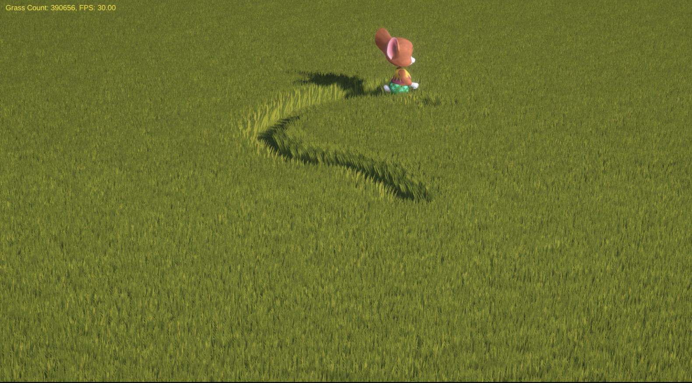
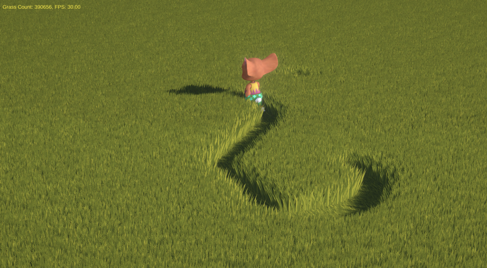
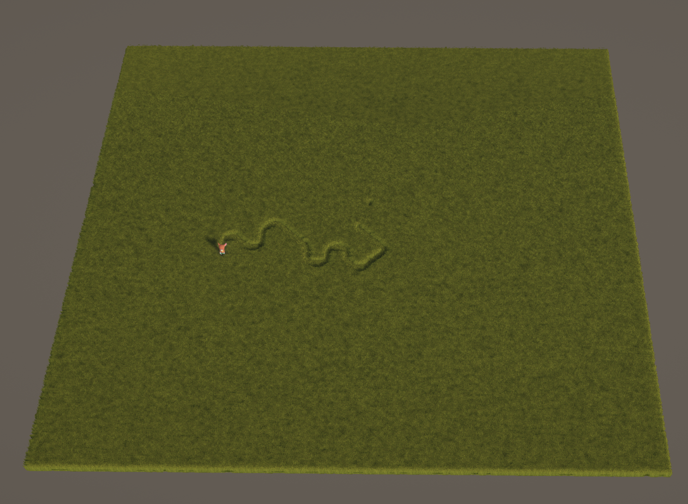

# Shader Programming Project 2024-2

A real-time interactive grass system developed for a university shader programming course. This project focuses on offloading complex grass physics and dense rendering workloads to the GPU to maintain high performance in Unity.

---

### GPU-Driven Architecture

The system is built on **GPU Indirect Instancing**, which allows for the drawing of thousands of uniquely transformed grass blades in a single draw call. By bypassing the traditional GameObject-based approach, CPU overhead is minimized, and the rendering bottleneck is shifted to the GPU where it belongs for this type of dense procedural geometry.

### Parallel Physics with Compute Shaders

Real-time interactions, such as grass trampling and bending, are handled via **Compute Shaders**.
- **Dynamic Interaction**: The positions of interactive entities (e.g., player, NPCs) are passed to the GPU every frame.
- **Buffer Management**: A `ComputeBuffer` stores the state of each grass clump, which is updated in parallel using a GPU kernel.
- **Physical Response**: The bending logic calculates distance-based displacement, ensuring the grass reacts fluidly to movements while maintaining a memory of its state for restoration.

### Stylized Technical Rendering

The visual presentation uses a custom **Toon Surface Shader** that works in tandem with the GPU buffer.
- **Vertex Deformation**: The shader reads interaction data directly from the structured buffer to apply vertex offsets for bending and swaying.
- **NdotL Lighting**: Implements a step-based light model to achieve a clean, illustrated aesthetic common in modern stylized games.
- **Procedural Variation**: Individual grass blades are randomized based on noise values calculated during initialization to avoid repetitive patterns.

---
*2024-2 University Course Work / Unity 2021.3+*
